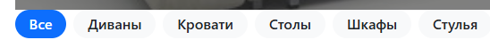
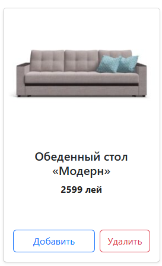

# Furniture Store

## Установка и запуск

### 1. Клонирование репозитория

```bash
git clone https://github.com/your-username/00_individual_project
cd 00_individual_project
```

### 2. Установка зависимостей

```bash
npm install
```

### 3. Установка всех библиотек по отдельности (при необходимости):

```bash
npm install react-router-dom
npm install axios
npm install bootstrap react-bootstrap
npm install redux react-redux @reduxjs/toolkit
npm install react-toastify
```

### 4. Запуск проекта

```bash
npm run dev
```

## Автор

- Юдина Мария - IA2304

## Описание проекта

**Furniture Store** — это веб-приложение для управления каталогом мебели, в котором пользователи могут просматривать товары, добавлять их в корзину, сортировать по категориям и цене, а также оформлять заказ. В проекте реализованы фильтрация товаров, пагинация, добавление товаров в корзину и их удаление, а также возможность добавления новых товаров.

### Цели проекта

**Цель проекта** — создать простое, но функциональное приложение для магазина мебели, которое демонстрирует основные концепты работы с React, Redux, роутингом и API-запросами.

### Основной функционал

- Просмотр товаров в каталоге. <br>

- Реализован слайдер, который показывает сменяющийся товар с возможностью узнать детали или добавить в корзину. <br>

- Фильтрация товаров по категориям.<br>

- Сортировка товаров по различным параметрам (цена, популярность и т.д.).<br>

- Добавление и удаление товаров в корзину.<br>
<br>

- Страница с детальным описанием товара.<br>

- Возможность добавления нового товара через форму.<br>

- Реализован компонент 404, отображающий сообщение "Страница не найдена".<br>

- Возможность очистки корзины и перехода к оплате.<br>

- Уведомления об успехе или ошибке действий<br>
<br>
<br>
- Реализована пагинация и отображение товара (по 4 товара на страницу).<br>

- Реализован поиск.<br>

- Реализован скелет товаров при загрузке.<br>

---

## Примеры использования

### Получение списка с сервера (Axios)

```js
  import axios from "axios";

  const fetchProducts = () => {
    setIsLoaded(true);
    const sortBy = sortType.replace("-", "");
    const order = sortType.includes("-") ? "asc" : "desc";
    const category = categoryId > 0 ? `category=${categoryId}` : "";
    const search = searchValue ? `&search=${searchValue}` : "";

    axios
      .get(
       `https://67e3389497fc65f5353912f7.mockapi.io/Items?limit=4&page=${currentPage}&${category}&sortBy=${sortBy}&order=${order}${search}`
      )
      .then((res) => {
       setItems(res.data);
       setIsLoaded(false);
      });

    window.scrollTo(0, 0);
  };
```

### Redux Slice корзины

```js
  import { createSlice } from "@reduxjs/toolkit";
  import { act } from "react";

  const initialState = {
   totalPrice: 0,
   items: [],
  };

  export const cartSlice = createSlice({
   name: "cart",
   initialState,
    reducers: {
     addItem: (state, action) => {
        const findItem = state.items.find((obj) => obj.id === action.payload.id); // ищем товар в массиве
       if (findItem) {
         findItem.count++;
       } else {
          state.items.push({ ...action.payload, count: 1 });
       }
        state.totalPrice = state.items.reduce((sum, obj) => {
         return obj.price * obj.count + sum;
       }, 0);
     },

     minusItem(state, action) {
       const findItem = state.items.find((obj) => obj.id === action.payload);

       if (findItem) {
          findItem.count--;
       }
     },

     removeItem: (state, action) => {
       state.items = state.items.filter((obj) => obj.id !== action.payload); 
     },

     clearItems(state) {
        state.items = [];
       state.totalPrice = 0;
     },
    },
  });

  export const { addItem, removeItem, clearItems, minusItem } = cartSlice.actions;

  export default cartSlice.reducer;
```

### Форма добавления (React Bootstrap)

```jsx
  import { useState } from "react";
  import { Form, Button } from "react-bootstrap";
  import axios from "axios";
  import { useNavigate } from "react-router-dom";

  function AddFurniturePage() {
  const [title, setTitle] = useState("");
  const [price, setPrice] = useState("");
  const [description, setDescription] = useState("");
  const [imageUrl, setImageUrl] = useState("");
  const [validated, setValidated] = useState(false);
  const navigate = useNavigate();

  const isImageUrlValid = (url) => {
    return /^https?:\/\/.*\.(jpg|jpeg|png|gif)$/.test(url);
  };

  const handleSubmit = (e) => {
    e.preventDefault();

    const isValid =
      title.trim() !== "" &&
      description.trim() !== "" &&
      !isNaN(price) &&
      Number(price) > 0 &&
      isImageUrlValid(imageUrl);

    setValidated(true);

    if (!isValid) return;

    axios
      .post("https://67e3389497fc65f5353912f7.mockapi.io/Items", {
        title,
        price,
        description,
        imageUrl,
      })
      .then((response) => {
        console.log("Товар добавлен:", response.data);
        navigate("/", { state: { success: true } });
      })
      .catch((error) => {
        console.error("Ошибка при добавлении товара:", error);
      });
    };

    return (
    <div className="container my-5">
      <h1>Добавить мебель</h1>
      <Form noValidate onSubmit={handleSubmit}>
        <Form.Group controlId="formTitle">
          <Form.Label>Название товара</Form.Label>
          <Form.Control
            type="text"
            placeholder="Введите название"
            value={title}
            onChange={(e) => setTitle(e.target.value)}
            isInvalid={validated && title.trim() === ""}
            isValid={validated && title.trim() !== ""}
          />
          <Form.Control.Feedback type="invalid">
            Введите название.
          </Form.Control.Feedback>
        </Form.Group>

        <Form.Group controlId="formPrice">
          <Form.Label>Цена</Form.Label>
          <Form.Control
            type="number"
            placeholder="Введите цену"
            value={price}
            onChange={(e) => setPrice(e.target.value)}
            isInvalid={
              validated && (price === "" || isNaN(price) || Number(price) <= 0)
            }
            isValid={validated && !isNaN(price) && Number(price) > 0}
          />
          <Form.Control.Feedback type="invalid">
            Введите корректную цену.
          </Form.Control.Feedback>
        </Form.Group>

        <Form.Group controlId="formDescription">
          <Form.Label>Описание</Form.Label>
          <Form.Control
            as="textarea"
            rows={3}
            placeholder="Введите описание"
            value={description}
            onChange={(e) => setDescription(e.target.value)}
            isInvalid={validated && description.trim() === ""}
            isValid={validated && description.trim() !== ""}
          />
          <Form.Control.Feedback type="invalid">
            Введите описание.
          </Form.Control.Feedback>
        </Form.Group>

        <Form.Group controlId="formImageUrl">
          <Form.Label>Ссылка на изображение</Form.Label>
          <Form.Control
            type="text"
            placeholder="Введите URL изображения"
            value={imageUrl}
            onChange={(e) => setImageUrl(e.target.value)}
            isInvalid={validated && !isImageUrlValid(imageUrl)}
            isValid={validated && isImageUrlValid(imageUrl)}
          />
          <Form.Control.Feedback type="invalid">
            Введите корректный URL (jpg, jpeg, png, gif).
          </Form.Control.Feedback>
        </Form.Group>

        <Button variant="primary" type="submit" className="mt-3">
          Добавить товар
        </Button>
      </Form>
    </div>
    );
  }

  export default AddFurniturePage;
```

---

## Тестирование

```jsx
  import React from 'react';
  import { render, screen, fireEvent } from '@testing-library/react';
  import { describe, it, expect } from 'vitest';
  import FurnitureCard from '../src/components/FurnitureCard'; 

  describe('FurnitureCard Component', () => {
    it('проверка добавления товара в корзину', () => {
    const item = {
      id: 1,
      title: "Диван",
      price: "1000",
      imageUrl: "/image.jpg"
    };

    render(<FurnitureCard {...item} />);

    expect(screen.getByText(/Добавить/)).toBeInTheDocument();

    fireEvent.click(screen.getByText(/Добавить/));

    expect(screen.getByText(/1000/)).toBeInTheDocument(); 
  });
  });
```

---

## Навигация (React Router)

```jsx
import { Routes, Route } from "react-router-dom";

  <Routes>
      <Route path="/" element={<Home />} />
      <Route path="/add" element={<AddFurniturePage />} />
      <Route path="/cart" element={<Cart />} />
      <Route path="*" element={<NotFound />} />
  </Routes>
```

---

## Использованные источники

- [React Pizza](https://www.youtube.com/ArchakovBlog)
- [react-pizza](https://github.com/Archakov06/react-pizza/tree/master)
- [React Documentation](https://reactjs.org/)
- [React Router](https://reactrouter.com/)
- [Redux Toolkit](https://redux-toolkit.js.org/)
- [MockAPI](https://mockapi.io/)
- [Axios](https://axios-http.com/)
- [Bootstrap](https://getbootstrap.com/)
- [React Toastify](https://fkhadra.github.io/react-toastify/)
