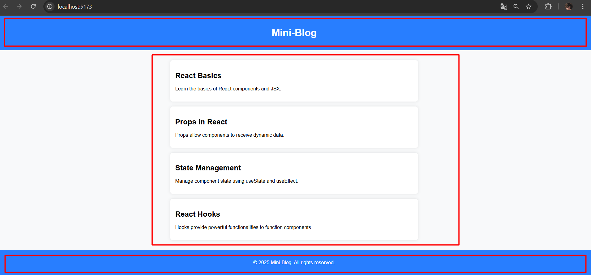

# Лабораторная работа №1. Установка и настройка React-приложения. Создание первых компонентов

## Цель работы

Познакомиться с библиотекой React, изучить основные концепции, научиться создавать и запускать React-приложение.

## Условие

### Задание 1. Подготовка рабочего окружения

1. Установка NodeJS

   - Скачала и установила последнюю версию Node.js.
   - Проверила установку, выполнив команды в терминале:

     ```bash
     node -v
     npm -v
     ```

   - Убедилась, что версии отображаются.

2. Настройка нового проекта React с помощью Vite.

   - В командной строке ввела команду:

     ```bash
     npm create vite@latest my-react-app
     ```

   - Выбрала:
     - **Framework**: React
     - **Variant**: JavaScript
   - Перешла в папку проекта

    ```bash
     cd my-react-app
     ```

   - Запустила сервер разработки:

    ```bash
     npm run dev
     ```

### Задание 2. Создание компонентов в React. Основа JSX

1. Создала компонент `Header`, который будет отображать заголовок страницы.

   - Создала файл `Header.jsx` в папке `src/components`.
   - В файле `Header.jsx` создала функциональный компонент `Header`, который возвращает JSX-разметку с заголовком.

   ```jsx
   function Header() {
    return (
      <header>
        <h1>Mini-Blog</h1>
      </header>
    );
  }
  
  export default Header;
   ```

2. Создала компонент `Footer`, который будет отображать подвал страницы.

   - Создала файл `Footer.jsx` в папке `src/components`.
   - В файле `Footer.jsx` создала функциональный компонент `Footer`, который возвращает JSX-разметку с подвалом.

   ```jsx
   function Footer() {
    return (
      <footer>
        <p>© {new Date().getFullYear()} Mini-Blog. All rights reserved.</p>
      </footer>
    );
  }
  
  export default Footer;
   ```

3. Создала компонент `Article`, который будет отображать статью.

   - Создала файл `Article.jsx` в папке `src/components`.
   - В файле `Article.jsx` создала функциональный компонент `Article`, который возвращает JSX-разметку с заголовком и текстом статьи.
   - Компонент `Article` должен принимать пропсы `title` и `text`.

   ```jsx
   function Article({ title, text }) {
    return (
      <article>
        <h2>{title}</h2>
        <p>{text}</p>
      </article>
    );
  }
  
  export default Article;
   ```

4. Создала компонент `ArticleList`, который будет отображать список статей.

   - Создала файл `ArticleList.jsx` в папке `src/components`.
   - В файле `ArticleList.jsx` создала функциональный компонент `ArticleList`, который возвращает JSX-разметку со списком статей.

   ```jsx
    function ArticleList() {
    const articles = [
        { title: "React Basics", text: "Learn the basics of React components and JSX." },
        { title: "Props in React", text: "Props allow components to receive dynamic data." },
        { title: "State Management", text: "Manage component state using useState and useEffect." },
        { title: "React Hooks", text: "Hooks provide powerful functionalities to function components." },
    ];

    return (
        <main>
        {articles.map((article, index) => (
            <Article key={index} title={article.title} text={article.text} />
        ))}
        </main>
    );
    }

    export default ArticleList;
   ```

5. Объединила компоненты `Header`, `Article` и `ArticleList` в компонент `App`.

   - Итоговая HTML-разметка выглядит следующим образом:

   ```html
   <header>
     <!-- Заголовок страницы -->
   </header>
   <main>
     <!-- Список статей -->
   </main>
   ```


### Задание 3. Тестирование компонентов

1. Запустила сервер разработки с помощью: `npm run dev`.
2. Открыла браузер и перешла по адресу указанному в консоли.
3. Проверила, что компоненты `Header`, `ArticleList` и `Footer` отображаются на странице.

## Контрольные вопросы

1. Что такое JSX и зачем он используется в React?
Это синтаксический расширение для JavaScript, которое позволяет писать HTML-подобный код внутри JavaScript. В React JSX используется для описания структуры UI-компонентов.
JSX позволяет писать структуру компонентов, как в HTML, что делает код более читаемым и удобным. JSX автоматически компилируется в JavaScript, что позволяет динамически изменять содержимое веб-страницы на основе состояния приложения. JSX улучшает разработку в React, позволяя проще соединять логику с разметкой.
2. Чем функциональные компоненты отличаются от классовых?
Функциональные компоненты:
Это обычные JavaScript функции, которые принимают props и возвращают JSX-разметку. Легче и проще, так как не требуется использования классов и методов. С момента введения хуков в React (начиная с версии 16.8), функциональные компоненты могут использовать состояние (useState) и другие возможности, такие как useEffect.

Классовые компоненты:
Создаются с помощью классов и должны расширять React.Component. Используют методы жизненного цикла и имеют доступ к состоянию через this.state и методы через this.setState. Более громоздкие по сравнению с функциональными компонентами, особенно в новых версиях React, где функциональные компоненты с хуками становятся более предпочтительными.
3. Как передавать данные в компонент через `props`?
props — это объект, который содержит все значения, передаваемые в компонент. В React данные передаются в компонент через props, и они доступны внутри компонента.
4. В каком формате принимаются `props` в функциональном компоненте?
В функциональном компоненте props принимаются как объект. Обычно этот объект передается как единственный параметр функции, и данные извлекаются из него.